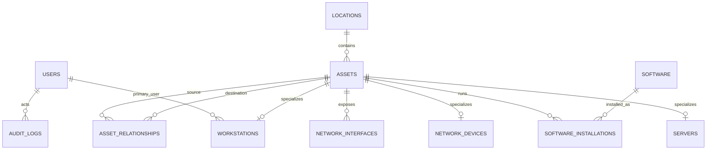
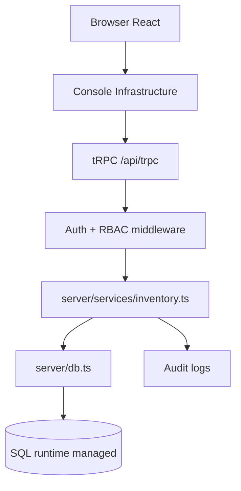
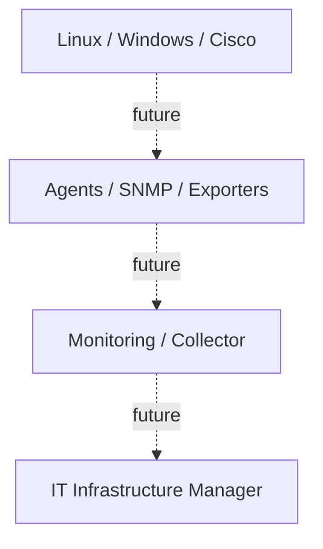

# Diagrammes Étape 2

## Modèle de données

## Architecture applicative livrée

## Architecture future, non livrée

Le dernier diagramme est une cible d’architecture. Aucun agent, exporter, accès SNMP, scan réseau ou flux de métriques n’est activé dans l’Étape 2.
